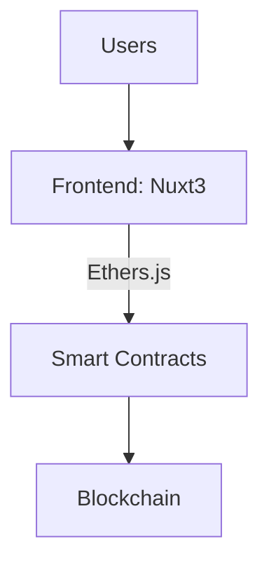

<div align="center">
  
</div>

# 🚀 StakeHive — Enterprise-Grade DeFi Staking Protocol

---

## 🔥 Live Demo

Explore the app live here:
[https://stakehive-defi-dapp.netlify.app/](https://stakehive-defi-dapp.netlify.app/)

StakeHive is a decentralized finance (DeFi) app enabling users to stake custom HIVE tokens, earn rewards, claim, withdraw, and transfer tokens securely on the blockchain.

---

## 🧪 How to Use StakeHive

Want to start staking with StakeHive? Follow these simple steps:

---

### 🔹 Step 1: Enable Test Networks in MetaMask

By default, MetaMask hides test networks. To enable them:

1. Open **MetaMask**.
2. Click on your **account icon** → **Settings**.
3. Navigate to **Advanced**.
4. Scroll to **Show test networks** and **toggle it ON**.
5. Return to the main screen, and you’ll now see **Sepolia** in the network dropdown.

---

### 🔹 Step 2: Add Sepolia Testnet (If Not Visible)

If Sepolia isn’t showing:

1. Click **"Select Network"** → **"Add network"** → **"Add network manually"**.

2. Fill in the following:

   ```
   Network Name: Sepolia Test Network
   RPC URL: https://rpc.sepolia.org
   Chain ID: 11155111
   Currency Symbol: ETH
   Block Explorer URL: https://sepolia.etherscan.io
   ```

3. Click **Save**.

---

### 🔹 Step 3: Get Sepolia ETH for Gas

You’ll need Sepolia ETH to pay for gas fees. Use one of the following faucets:

- [Alchemy Sepolia Faucet](https://sepoliafaucet.com/)
- [Chainlink Sepolia Faucet](https://faucets.chain.link/sepolia)
- [Google Cloude Sepolia Faucet](https://cloud.google.com/application/web3/faucet/ethereum/sepolia)

Paste your MetaMask wallet address and request test ETH.

---

### 🔹 Step 4: Add HIVE Token to MetaMask

To see your HIVE token in MetaMask:

1. Open MetaMask → go to **Assets** → click **Import tokens**.

2. Enter your deployed token details:

   ```
   Token Contract Address: 0x359863fB0ca4E4be77daD9dFFBB0BbdA94690cCC
   Token Symbol: HIVE
   Decimals: 18
   ```

3. Click **Add Custom Token** → **Import Tokens**.

You'll now see your HIVE balance.

> ⚠️ **Note**: This is the current Sepolia deployment address. If you deploy your own contracts, use the address printed in your deploy output.

---

### 🔹 Step 5: Connect Wallet to StakeHive

1. Visit the live app: [https://stakehive-defi-dapp.netlify.app](https://stakehive-defi-dapp.netlify.app)
2. Click **Connect Wallet**.
3. Choose MetaMask or another supported wallet via **Web3Modal**.

---

## 🔁 StakeHive Features & How to Use Them

---

### ✅ Stake HIVE Tokens

- Go to the **Stake** section.
- Enter the amount of HIVE you want to stake.
- Click **Stake**, then approve the transaction in MetaMask.
- Your tokens are now staked and earning rewards.

---

### 💸 Claim Rewards

- Navigate to the **Rewards** section.
- Click **Claim** and approve the transaction.
- Your rewards are sent to your wallet instantly.

---

### 🔓 Withdraw Staked Tokens

> ⚠️ You can only withdraw after the lock duration expires.

- Go to your **Staked Balance**.
- Click **Withdraw**, confirm in MetaMask.
- Staked tokens will return to your wallet.

---

### 🔁 Transfer HIVE Tokens

- Open the **Transfer** tab.
- Enter the recipient wallet address and amount.
- Click **Send** and confirm the transaction.
- Tokens are transferred peer-to-peer via blockchain.

---

## 🎯 Pro Tips

- Make sure you have **Sepolia ETH** in your wallet for transactions.
- View all your blockchain activity on [Sepolia Etherscan](https://sepolia.etherscan.io).
- If tokens aren’t showing in MetaMask, use **"Import Tokens"** with your HIVE token contract address.
- Use this app for **educational and testing purposes only** — the tokens and network are not real/mainnet.

---

## ✨ Key Features

| Feature            | Description                                                             | Tech Used               |
| ------------------ | ----------------------------------------------------------------------- | ----------------------- |
| Custom ERC20 Token | `HIVE` token with minting and burning functionality                     | Solidity, OpenZeppelin  |
| Staking Contract   | Time-locked staking with secure rewards distribution                    | Solidity, Hardhat       |
| Token Transfer     | Transfer HIVE tokens between accounts with blockchain verification      | Ethers.js, MetaMask     |
| Real-Time Updates  | Reactive UI reflecting live balances, rewards, and transaction statuses | Vue 3, Nuxt 3, Tailwind |
| Wallet Integration | Supports MetaMask, WalletConnect, and Coinbase Wallet                   | Web3Modal               |
| Responsive UI      | Mobile and desktop friendly dashboard with staking analytics and charts | Tailwind CSS, Chart.js  |

---

## 🏗️ Architecture Overview

Here’s a simplified view of the StakeHive architecture — how components connect and communicate:



---

## 🛠️ Technology Stack

### Smart Contracts

- **Language**: Solidity (v0.8+)
- **Frameworks**: Hardhat for development, testing, and deployment
- **Testing**: Mocha, Chai, and Slither static analysis for security checks
- **Network**: Deployed on Sepolia Testnet (Etherscan verified)

### Frontend

- **Framework**: Nuxt 3 with Composition API (Vue 3)
- **Blockchain**: Ethers.js v6 for smart contract interaction
- **Wallets**: MetaMask, WalletConnect, Coinbase Wallet through Web3Modal
- **Styling**: Tailwind CSS + DaisyUI for rapid, responsive UI development
- **Charts & Analytics**: Chart.js for staking and reward visuals
- **Deployment**: Hosted on Netlify

---

## 📦 Getting Started

### Prerequisites

- Node.js v16+ and npm
- MetaMask or compatible Web3 wallet
- Sepolia testnet ETH (from faucet)
- Git

---

### 🚀 Quick Start (Testing Only)

Want to just test the dApp without deploying? Use the pre-deployed contracts:

```bash
# 1. Clone the repo
git clone https://github.com/Darahat/stakehive-dapp.git
cd stakehive-dapp

# 2. Install Web3 dependencies
npm install

# 3. Install frontend dependencies
cd frontend
npm install

# 4. Run the frontend
npm run dev
```

The dApp is pre-configured with deployed Sepolia contracts:

- **HiveToken**: `0x359863fB0ca4E4be77daD9dFFBB0BbdA94690cCC`
- **StakeHiveFarm**: `0x3531D47A28Aa87Bd5F9eaD3D2d8Fe07Ce16C8DDc`

Just connect your wallet and you're ready to go! 🎉

---

### 🛠️ Full Development Setup

For developers who want to deploy their own contracts:

```bash
# 1. Clone the repo
git clone https://github.com/Darahat/stakehive-dapp.git
cd stakehive-dapp

# 2. Install dependencies for backend and frontend
npm install
cd frontend
npm install
cd ..

# 3. Start local blockchain (in a separate terminal)
# Open a new terminal and run:
npx hardhat node
# Keep this terminal running

# 4. Deploy contracts to localhost (in your main terminal)
npx hardhat run scripts/deploy-and-update.js --network localhost

# Note: No .env file needed for localhost! Only required for Sepolia testnet deployment

# 5. Run the frontend
cd frontend
npm run dev

```

**Environment Variables (.env)** - Only needed for Sepolia deployment:

```bash
# Create .env file only if deploying to Sepolia testnet
cp .env.example .env

# Then edit .env with:
SEPOLIA_RPC_URL=https://eth-sepolia.g.alchemy.com/v2/YOUR_API_KEY
PRIVATE_KEY=your_wallet_private_key_without_0x

# Deploy to Sepolia:
npx hardhat run scripts/deploy-and-update.js --network sepolia
```

---

### 🔴 **CRITICAL: Understanding Contract Addresses**

The project uses **dynamic address mapping** based on network chain ID. Contract addresses are stored in `frontend/utils/contract.js`:

```javascript
export const ADDRESS_MAP = {
  31337: {
    // Hardhat Local Network
    HIVE_TOKEN: "0x5FbDB2315678afecb367f032d93F642f64180aa3",
    STAKE_HIVE: "0xe7f1725E7734CE288F8367e1Bb143E90bb3F0512",
  },
  11155111: {
    // Sepolia Testnet
    HIVE_TOKEN: "0x359863fB0ca4E4be77daD9dFFBB0BbdA94690cCC",
    STAKE_HIVE: "0x3531D47A28Aa87Bd5F9eaD3D2d8Fe07Ce16C8DDc",
  },
};
```

When you connect MetaMask, the dApp automatically:

1. Detects your network's chain ID
2. Loads the correct contract addresses for that chain
3. Queries those contracts for balances and data

**⚠️ Important**: Running deployment scripts creates **NEW** contracts with **NEW** addresses. The frontend must be updated with these new addresses.

---

### 🟢 Option A: Automated Deployment (Recommended)

Use this script that automatically updates frontend addresses:

```bash
# Deploy to Sepolia and auto-update frontend
npx hardhat run scripts/deploy-and-update.js --network sepolia

# Or for local Hardhat network:
npx hardhat node  # Terminal 1 - keep running
npx hardhat run scripts/deploy-and-update.js --network localhost  # Terminal 2
```

**What this does:**

1. ✅ Deploys HiveToken
2. ✅ Deploys StakeHiveFarm
3. ✅ Transfers tokens to farm
4. ✅ Sets reward rate
5. ✅ **Automatically updates `frontend/utils/contract.js`**
6. ✅ Prints new addresses and next steps

**After automated deployment:**

```bash
# 1. Import new token to MetaMask with printed address
# 2. Transfer tokens to your wallet (update recipient address in script first)
npx hardhat run scripts/transfer-tokens.js --network sepolia

# 3. Start the frontend
cd frontend
npm run dev
```

---

### 🔴 Option B: Manual Deployment (Not Recommended)

If you prefer manual control:

```bash
# Deploy contracts
npx hardhat run scripts/deploy.js --network sepolia
```

**⚠️ You MUST manually update addresses after this!**

**Method 1: Use the address update script**

```bash
node scripts/update-addresses.js <chainId> <hiveTokenAddress> <stakeHiveFarmAddress>

# Example:
node scripts/update-addresses.js 11155111 0x123... 0x456...
```

**Method 2: Manually edit `frontend/utils/contract.js`**

Open `frontend/utils/contract.js` and update the ADDRESS_MAP:

```javascript
export const ADDRESS_MAP = {
  11155111: {
    // Sepolia
    HIVE_TOKEN: "0xYOUR_NEW_TOKEN_ADDRESS",
    STAKE_HIVE: "0xYOUR_NEW_FARM_ADDRESS",
  },
};
```

**After manual update:**

```bash
# 1. Restart frontend dev server
cd frontend
npm run dev

# 2. Hard refresh browser (Ctrl+Shift+R)
# 3. Reconnect MetaMask wallet
# 4. Import new HIVE token address to MetaMask
# 5. Transfer tokens to your account
```

---

### 🧪 Running Tests

Comprehensive test suite with 10+ tests:

```bash
# Run all tests
npx hardhat test

# Run specific test file
npx hardhat test test/StakeHiveFarm.test.js

# Run with gas reporting
REPORT_GAS=true npx hardhat test
```

Test coverage includes:

- ✅ Staking functionality
- ✅ Reward calculations
- ✅ Withdraw operations
- ✅ Token transfers
- ✅ Error handling
- ✅ Edge cases

---

## 🎓 Usage Guide & Best Practices

### Connecting Your Wallet

1. **Ensure you're on Sepolia Testnet** in MetaMask
2. Click **Connect Wallet** in the dApp
3. The dApp automatically detects your network and loads correct addresses
4. Browser console shows: `🔗 Connected to chain 11155111 (sepolia)`

### Getting HIVE Tokens

**If using pre-deployed contracts**: Request tokens by [opening an issue](https://github.com/Darahat/stakehive-dapp/issues) with your wallet address.

**If you deployed your own**: Transfer tokens from the deployment account:

```bash
# Edit scripts/transfer-tokens.js with:
# - recipientAddress: your wallet address
# - hiveTokenAddress: your deployed token address
# - transferAmount: amount to transfer (default: "10000")

npx hardhat run scripts/transfer-tokens.js --network sepolia
```

### Importing HIVE Token to MetaMask

1. Open MetaMask
2. Go to **Assets** → **Import tokens**
3. Enter the contract address (check console logs or `frontend/utils/contract.js`)
4. Token Symbol: **HIVE**
5. Decimals: **18**

### Using StakeHive Features

- **Staking**: Enter amount → Click Stake → Approve in MetaMask
- **Claiming Rewards**: Navigate to Rewards → Click Claim → Approve transaction
- **Withdrawing**: After lock period expires → Click Withdraw → Approve transaction
- **Transferring**: Enter recipient address and amount → Click Transfer → Approve

### Important Notes

- **Gas Fees**: You need Sepolia ETH for all transactions. Get it from [Sepolia Faucet](https://sepoliafaucet.com/)
- **Token Balances**: Displayed dynamically from blockchain, updated automatically
- **Staking Limits**: Can only stake up to your current HIVE balance
- **Lock Period**: Check staking dashboard for withdraw availability
- **Real-Time Updates**: Vue watchers ensure UI reflects blockchain state automatically
- **Transaction Confirmation**: All actions require MetaMask approval

---

## 📊 Performance Highlights

| Metric               | Value                |
| -------------------- | -------------------- |
| Contract Size        | \~24.5 KB            |
| Average Gas Cost     | \~142,000 gas        |
| Transactions Per Sec | \~18.7 TPS (testnet) |
| Frontend Load Time   | \~1.2 seconds        |

---

## 🔧 Developer Tools & Scripts

### Available Scripts

| Script           | Command                                                             | Description                                          |
| ---------------- | ------------------------------------------------------------------- | ---------------------------------------------------- |
| Deploy (Auto)    | `npx hardhat run scripts/deploy-and-update.js --network sepolia`    | **Recommended**: Deploys and auto-updates frontend   |
| Deploy (Manual)  | `npx hardhat run scripts/deploy.js --network sepolia`               | Standard deployment (requires manual address update) |
| Update Addresses | `node scripts/update-addresses.js <chainId> <tokenAddr> <farmAddr>` | Manually update frontend addresses                   |
| Transfer Tokens  | `npx hardhat run scripts/transfer-tokens.js --network sepolia`      | Transfer HIVE to your wallet                         |
| Run Tests        | `npx hardhat test`                                                  | Run full test suite                                  |
| Start Frontend   | `cd frontend && npm run dev`                                        | Launch development server                            |
| Build Frontend   | `cd frontend && npm run build`                                      | Production build                                     |

### Project Structure

```
stakehive-dapp/
├── contracts/              # Solidity smart contracts
│   ├── HiveToken.sol      # ERC20 token with mint/burn
│   └── StakeHiveFarm.sol  # Staking rewards contract
├── scripts/               # Deployment and utility scripts
│   ├── deploy-and-update.js   # Automated deployment ✅
│   ├── deploy.js             # Manual deployment
│   ├── update-addresses.js   # Address updater utility
│   └── transfer-tokens.js    # Token transfer helper
├── test/                  # Hardhat test suite
│   └── StakeHiveFarm.test.js
├── frontend/              # Nuxt 3 frontend
│   ├── components/        # Vue components
│   ├── pages/            # Route pages
│   ├── stores/           # Pinia state management
│   │   └── walletStore.js   # Wallet & blockchain logic
│   ├── utils/
│   │   └── contract.js      # Contract ABIs & addresses ⚠️
│   └── plugins/
│       └── web3.js          # Ethers.js setup
├── hardhat.config.js     # Hardhat configuration
├── .env.example          # Environment template
└── .env                  # Your secrets (gitignored)
```

### Key Files to Know

- **`frontend/utils/contract.js`**: Contains ADDRESS_MAP - update after deploying
- **`frontend/stores/walletStore.js`**: Wallet connection and blockchain interactions
- **`hardhat.config.js`**: Network configurations and compiler settings
- **`.env`**: Your private key and RPC URLs (NEVER commit this!)

### Debugging Tips

**Check browser console for logs:**

- `🔗 Connected to chain 11155111` - Network detected
- `📍 Using addresses: {...}` - Addresses loaded for current chain
- `💰 Fetching balance from HIVE token at: 0x...` - Balance query
- `📊 Raw balance (wei): ...` - Retrieved balance before formatting

**Common console errors and solutions:**

- `❌ No contract code at 0x...` → Wrong network or address mismatch
- `Error fetching token balance` → Check provider initialization
- `Unknown Token` → Import token to MetaMask with correct address

---

## ⚠️ Troubleshooting Guide

### 🔴 "Available Balance: 0.00 HIVE" but MetaMask shows tokens

**Cause**: Contract address mismatch between MetaMask and frontend

**Solution**:

1. Open browser console (F12)
2. Find log: `💰 Fetching balance from HIVE token at: 0x...`
3. Compare with MetaMask token address
4. **If different**, either:
   - **Option A**: Update MetaMask with the address from console log
   - **Option B**: Update `frontend/utils/contract.js` with MetaMask's address
5. Restart frontend and hard refresh (Ctrl+Shift+R)
6. Reconnect wallet

### 🔴 "Unknown Token" in MetaMask

**Solution**: Manually import the HIVE token:

1. MetaMask → Assets → Import tokens
2. Enter contract address (check console logs or `frontend/utils/contract.js`)
3. Symbol: `HIVE`, Decimals: `18`

### 🔴 Transaction Failures

**Check these:**

- ✅ Enough Sepolia ETH for gas? (Get from [faucet](https://sepoliafaucet.com/))
- ✅ Enough HIVE tokens for the transaction?
- ✅ Token approval granted for staking contract?
- ✅ On correct network (Sepolia = Chain ID 11155111)?

### 🔴 Frontend doesn't recognize deployed contracts

**After deploying new contracts:**

1. Verify addresses updated in `frontend/utils/contract.js`
2. Restart frontend dev server
3. Hard refresh browser (Ctrl+Shift+R)
4. Reconnect MetaMask wallet
5. Check console for correct addresses being loaded

### 🔴 "Receiver must be an instance of class" error

**Cause**: Using Pinia store proxy instead of actual ethers provider

**Solution**: Already fixed in codebase. Update to latest version.

### 🔴 Wallet not detected

**Solution**:

- Install [MetaMask](https://metamask.io/)
- Refresh page after installation
- Check if MetaMask is unlocked

### 🔴 Contract deployment fails

**Common causes:**

- ❌ Missing or invalid `SEPOLIA_RPC_URL` in `.env`
- ❌ Missing or invalid `PRIVATE_KEY` in `.env`
- ❌ Not enough Sepolia ETH in deployment wallet
- ❌ Network congestion (retry after a moment)

### 💡 Best Practices

1. ✅ **Always use `deploy-and-update.js`** for deployments
2. ✅ **Test on local Hardhat first** before Sepolia
3. ✅ **Check console logs** for debugging information
4. ✅ **Document new addresses** after deployment
5. ✅ **Transfer tokens to test accounts** after deployment
6. ❌ **Never commit `.env`** file with private keys
7. ❌ **Don't manually edit deployment scripts** unless you know what you're doing

---

## 👨‍💻 Developer Notes

- This app uses **Ethers.js v6** — syntax differs from v5 (especially `parseEther` and contract calls).
- Smart contracts include reentrancy guards and gas optimizations.
- Vue 3 Composition API provides modular and reactive state management with watchers for blockchain state.
- The frontend automatically updates staking and rewards info on wallet events.
- The backend admin panel (Laravel) manages off-chain data and analytics (not included in this repo).

---

## 📬 Contact & Collaboration

**Didarul Alam Rahat**
Senior Full Stack & Web3 Developer

- 🔗 [LinkedIn](https://linkedin.com/in/darahat)
- 📧 [darahat42@gmail.com](mailto:darahat42@gmail.com)
- 🐦 [@darahat42](https://twitter.com/darahat42)

_Open to senior Web3 roles, audits, consulting, and collaborations._

---

## 📜 License

MIT License © 2023 Didarul Alam Rahat

---

Feel free to open issues or submit pull requests to improve the project! Your feedback and contributions are welcome.

---

**Happy BUIDLing!** 🚀🐝

---
